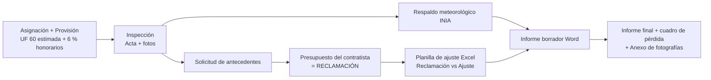
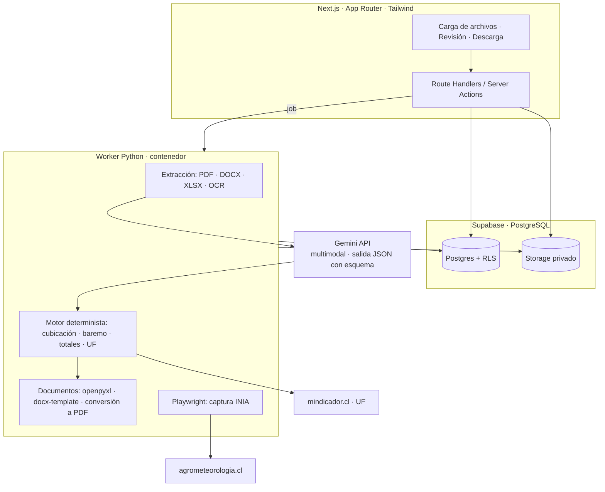

# Ajustador de Siniestros — Informe de análisis y diseño de la aplicación

> Proyecto: `cesar` · Fecha: 02/10/2026 · Stack pedido: Next.js + Tailwind + PostgreSQL · IA: Gemini vía API
> Base del análisis: carpeta `fuente/` (4 casos Beckett S.A. / HDI Seguros / BancoEstado) y el texto «Rol Eres un Liquidador de Siniestro».
> Documentos hermanos: [`02-plan-de-desarrollo.md`](02-plan-de-desarrollo.md) · [`03-prompt-maestro.md`](03-prompt-maestro.md)

**Estado de verificación.** Todo lo que sigue sobre los casos sale de leer los archivos reales (texto extraído de 43 documentos, planillas leídas celda a celda, informes finales convertidos a PDF con Word y revisados página a página). Lo que **no** se ha probado aún está marcado como *(sin probar)*: ninguna llamada a Gemini, el endpoint histórico de INIA, ni la generación de Word/Excel de la futura app.

---

## 1. Qué se pide y qué es en realidad el problema

Un liquidador recibe un reclamo, inspecciona, recibe un presupuesto del contratista del asegurado y debe emitir un **informe de liquidación** (Word/PDF) con un **cuadro de pérdida** (Excel pegado como imagen) que dice cuánto indemniza la aseguradora. La aplicación automatiza esa cadena con un agente que actúa como perito senior.

El hallazgo central del análisis es que **el trabajo no es «escribir con IA»**: es una mezcla de cuatro cosas de naturaleza distinta, y mezclarlas en un único prompt es la forma más segura de que el sistema invente cifras.

| Parte del trabajo | Naturaleza | Quién lo hace en la app |
|---|---|---|
| Leer actas, presupuestos, mandatos escaneados, fotos | Percepción | Gemini (multimodal) |
| Decidir qué se acepta, recorta o excluye y por qué | Criterio pericial | Gemini, con reglas de oro, **en salida estructurada** |
| Aritmética (m², totales, GG, IVA, UF), precios de baremo, «la reclamación es sagrada» | Determinista | **Código**, nunca el modelo |
| Reproducir el formato exacto Word/Excel con imágenes | Ingeniería documental | Plantillas + motor de documentos |

---

## 2. Inventario de la carpeta fuente

336 archivos en 4 casos. Cada caso replica la misma anatomía:

| Carpeta / archivo | Qué es | Rol en la app |
|---|---|---|
| `TEXTO/INSP.-NNNNN.pdf` | **Acta de inspección**: identificación, hechos, descripción del inmueble (pisos, dormitorios, baños, m², antigüedad, sistema estructural, techumbre, cubierta, pavimentos), tabla de daños por recinto (alto/ancho/largo, descripción, tipo, m²), firma, carnet del firmante | Entrada principal |
| `TEXTO/NNNN Provisión.pdf` | Provisión de pérdida: póliza, ítem, vigencia, suma asegurada, deducible, beneficiario, asegurado, RUT, fechas de asignación/denuncia | Entrada (datos de portada) |
| `CORRESPONDENCIA/Solicitud de antecedentes (.docx/.pdf)` | Carta que pide presupuesto, croquis, otros seguros, fotos de cubierta, boleta de servicios, mandato | Plantilla de salida (secundaria) |
| `DOCUMENTOS/` | Lo que aporta el asegurado: presupuesto del contratista (PDF o XLSX), informe técnico del contratista (DOCX), mandato (PDF, **a veces escaneado**) | Entrada: la **Reclamación** |
| `FOTOGRAFÍAS/<Recinto>/*.jpg` | 49 / 104 / 85 / 50 fotos, ya clasificadas por carpeta de recinto (nombres tipo `1FD0Y_20260807_175452.jpg`) | Entrada visual |
| `TEXTO/NNNN Informe borrador.docx` | Plantilla Word con marcas `xx`/`xxx` y `${tabla_apu}` (caso 4: sin rellenar) | **Plantilla maestra del informe** |
| `NNNN INFORME FINAL.docx` | Informe emitido (casos 1–3). **No existe para el caso 4** | Verdad de referencia (golden) |
| `NNNN Ajuste v1.xlsx` / `Ajuste NNNN.xlsx` | Planilla de ajuste (ver §5) | Plantilla Excel + verdad de referencia |
| `Anexo Fotografías NNNN.doc` | Portada «ANEXO FOTOGRAFÍAS» + fotos 2×2 por recinto (10 páginas en el caso 1) | Segundo entregable |

### Los cuatro casos

| Caso | Inmueble | Reclamación (con GG+IVA) | Qué trae | Resultado emitido |
|---|---|---|---|---|
| 1981023 · Riquelme · Concepción | Albañilería, techo zinc/fibrocemento | $8.502.565 = **UF 208,17** | Presupuesto XLSX + informe técnico + mandato | **UF 46,73** (informe final) |
| 1984654 · Cabrera · Chillán | Albañilería, zinc alum, 2 pisos | **No hay presupuesto**: el asegurado pidió «pérdida determinada» | Solo acta + fotos | **UF 26,49** |
| 1984673 · Gajardo · Temuco | Madera, 1 piso, 55 m², 23 años | $11.701.639 = **UF 286,49** | Presupuesto PDF (GG 12 % + utilidad 10 % separados) | **UF 27,41** |
| 1984853 · Olea · Osorno | Madera, 2 pisos, 90 m², 7 años | $7.656.668 = **UF 187,46** | Presupuesto PDF + mandatos escaneados | **Sin informe final** → caso de validación ciego |

Consecuencia de diseño: la app debe soportar **dos modos** — *Ajuste de reclamación* (hay presupuesto) y *Pérdida determinada* (no lo hay: el perito valoriza desde el acta; la planilla tiene una sola columna de valores).

---

## 3. Cómo se hace hoy (el flujo que se automatiza)

### De dónde sale cada campo del informe

| Sección del informe | Fuente | Observación |
|---|---|---|
| Portada: fechas, ubicación, póliza, ítem, vigencia, suma asegurada, deducible, beneficiario, asegurado, RUT | Provisión + Acta | Deterministas. Casos 1–3 tienen RUT/póliza coherentes entre documentos |
| Cuantía de portada (Reclamación, Ajuste, Deducible, Indemnización en UF) | Planilla Excel | Calculado |
| Texto de la **denuncia** | **Ningún archivo de la carpeta** | Aparece solo en los Word, tecleado a mano desde la denuncia del asegurador (en el caso 4 está vacío). Es un **dato de entrada extra**: campo manual o `[FALTA DATO]` |
| Características del bien | Acta §III–IV | Ver conflictos en §8: el acta del caso 1 trae superficie 0 y antigüedad 0, y el informe final dice «2 pisos, 70 m²» (el acta dice 1 piso) |
| Evidencia observada | Acta §VI + fotos | Viñetas por recinto; los daños **no atribuibles** también se anotan (p. ej. «desconchado superficial… no relacionado con el siniestro») |
| Respaldo meteorológico | agrometeorologia.cl | Captura del gráfico con tooltip del día + texto con mm y ráfaga (ver §7) |
| Cobertura, exclusiones, suma asegurada | Textos fijos de la póliza | Cláusula `CAD120130071` literal; a primera pérdida (art. 553 C. Comercio) |
| Ajuste de pérdida (párrafo) | Criterio del perito | Texto estándar + exclusiones por caso |
| Cuadro de pérdida | Excel | En los finales está **pegado como imagen** de la hoja EDIFICIO |
| UF | Fecha del siniestro | El Excel usa $40.844,79. La API pública `mindicador.cl` devuelve exactamente ese valor para el 15 y 16/07/2026 *(comprobado)* |
| Anexos legales (arts. 26 y 27 del Reglamento) | Texto fijo | Obligatorio en todo informe |

---

## 4. La plantilla Word («modelo exacto»)

Hechos medidos sobre `1981023 INFORME FINAL.docx` (15 páginas al convertirlo con Word):

- **Cabecera con logo Beckett** en páginas 2+ (imagen en `header2.xml`), pie con «Liquidación NNNNNN/2026 · Beckett S.A. Liquidadores de Seguros · Página», y pie de portada con la dirección de la oficina. Dos secciones (`sectPr`).
- Portada en **versalitas** con tablas de «Del reclamo / De la póliza / Del beneficiario / Del asegurado / De la cuantía / De la recuperación».
- Fotos en **tablas de 2 columnas** (hasta 3 filas por recinto), con pie descriptivo bajo cada grupo.
- La captura de INIA es una imagen con su pie «Fuente: Reporte Red Agrometeorología de Inía / Fuente: https://agrometeorologia.cl».
- El **cuadro de pérdida** es una imagen de página completa (PNG de 82 KB en el caso 1; en la plantilla `TEXTO/` es un EMF de 2,7 MB bajo el marcador `${tabla_apu}`).
- Cierre: conclusión, firma «BECKETT S.A. LIQUIDADORES DE SEGUROS», CC a BancoEstado Corredores, y el anexo con los artículos 26 y 27.
- La plantilla ya contiene marcas de sustitución (`xx`, `xxx`, `${tabla_apu}`) y texto con errores heredados («CAD120130071para», «de la nturaleza»…).

**Decisión:** no se regenera el Word desde cero. Se **parte de la plantilla `.docx` real** (cabeceras, estilos, logo, secciones) y se rellena por marcadores y bloques repetibles. Es la única forma de garantizar «modelo exacto». El PDF se obtiene convirtiendo ese mismo `.docx`.

---

## 5. La planilla Excel (formato establecido)

Cada libro tiene 5 hojas; **la hoja `Datos` es idéntica en los 7 libros** (417 filas, 70 precios distintos):

| Hoja | Contenido | Para la app |
|---|---|---|
| `EDIFICIO` | Cabecera (evento, compañía, asegurado, fecha, siniestro, ubicación, monto asegurado, cobertura) · tabla Ítem / Descripción / **Reclamación** (u/m, Cant., P.Unit., Total) / **Valor ajustado** (u/m, Cant., P.Unit., Total) / OBS · Total directo → GG y utilidades → Neto → IVA → Total con IVA → UF → Deducible → Valor a indemnizar · Moneda, Fecha de pérdida, Indicador FDP (UF) · Leyenda | **Salida principal** |
| `Datos` | **El baremo**: descripción + precio unitario (a todo costo), 417 partidas | Base de conocimiento de precios |
| `Calculo de Area` | Bloques por recinto: alto, largo, ancho → ML, muros, cielo, piso | Motor de cubicación |
| `Siniestros anteriores` | Historial de la dirección (caso 1: siniestro 1877842, UF 27,03, otra dirección, «No» relación) | Consulta/entrada |
| `%` | Depreciación por vida útil | **No se aplica** en pérdida parcial (póliza); se conserva la hoja |

### Hallazgos sobre el baremo y la cubicación

1. **El baremo cubre entre 60 % y 90 % de los precios ajustados** (32/40 en el caso 1, 36/60 en el caso 3, 39/45 en el caso 4; el caso 2 no tiene precios en la columna de ajuste). El resto son precios *de mercado consultados* (hojalatería, fletes, andamios, piso flotante, yeso-cartón). El agente **no puede inventarlos**: la app necesita un baremo ampliable y un campo «precio de mercado consultado» con fuente.
2. Hay **duplicados con el mismo nombre y precios distintos** (p. ej. «Aplicación Fragüe Impermeable Topex» a $3.600 y $3.120; «Instalación placas buldog» $34.200 y $9.240). La búsqueda de baremo debe devolver candidatos y exigir desambiguación, no tomar el primero.
3. **Fórmula del muro afectado**: el «paño» se calcula como `(perímetro × alto − 30 % de vanos) / 4`. En un recinto de 3,2×3,2×2,4 da **5,38 m²** (un muro neto). Aparece como cantidad ajustada en pintura de muros en el caso 1 (hoja `Calculo de Area`, fórmula `=(2·alto·largo + 2·alto·ancho)·0,7 / 4`); en el caso 4 hay valores del mismo tipo (10,41; 14,44…) cuya fórmula no verifiqué. Es la forma concreta de la regla «terminaciones estéticas al 100 % del paño».
4. **Plancha = 2,88 m²** (1,2×2,4): es el mínimo técnico que aparece como cantidad ajustada en yeso-cartón (caso 3 y 4). El resto de mínimos preventivos son **1** y **2** (empastes, base aparejo).
5. **Los precios ajustados que no se pueden reproducir con el baremo se deben marcar** (no se aceptan «de memoria»).

### Dos versiones de planilla en cada caso: una pista importante

| Caso | `Ajuste NNNN.xlsx` (más antigua) | `Ajuste vN.xlsx` (posterior, la del informe final) |
|---|---|---|
| 1 | UF 23,80 · total directo $653.403 | **UF 46,73** · $1.283.060 |
| 2 | UF 21,60 | **UF 26,49** |
| 3 | UF 17,70 | **UF 27,41** |
| 4 | **UF 40,44** (única) | — |

Por fecha de modificación e inspección del contenido, la versión *posterior* (la emitida) es **más generosa**: donde la primera deja cantidad **0** («C: no se registran daños») la emitida deja el **mínimo preventivo 1 o 2** y mantiene el precio. Eso es exactamente la «Regla del 1» del prompt. **Esto es una inferencia mía y necesita su confirmación** (ver §12, pregunta 1), porque define qué planilla se usa como *golden* para evaluar al agente: la emitida (`v1`) en los casos 1–3.

---

## 6. Las reglas de oro frente a los datos: dónde encajan y dónde hay que decidir

Las reglas de su texto están respaldadas por los casos. Contrastarlas con los datos reales dejó estas tensiones, que conviene resolver **antes** de escribir el prompt:

| # | Tensión | Qué muestran los datos | Propuesta |
|---|---|---|---|
| 1 | «La Reclamación es sagrada» vs. los datos reales | En el caso 1 el contratista tiene cantidad `3,072` y el Excel de ajuste la transcribió como `3,07`. Con decimales exactos el total del contratista es $5.716.010,32 (**coincide con su total**); con los redondeados, $5.716.145 (+$135) | Transcribir **sin redondear**, guardar hash de la columna y **comparar contra el total que declara el contratista**; cualquier diferencia es alerta |
| 2 | «El PU nunca va a 0; si debe ir a 0 va la cantidad» | Coherente con los libros emitidos (precio se mantiene, cantidad 0 o 1) | Validador del motor: PU ajustado > 0 siempre |
| 3 | Letra OBS para **cantidad 0** | La nueva leyenda no tiene «no se registran daños» como cantidad cero: **D** dice «mínimo preventivo» (cantidad 1). Para daños ajenos al evento (piso flotante gastado, cielo sin pintura de origen, desconchado previo) corresponde **A** | Regla: 0 con **A** (deterioro/mantención) o **E** (absorbida); 1 con **D** (preventivo). Confirmar |
| 4 | «PROHIBIDO SUPONER» vs. «[FALTA DATO]» | El acta del caso 1 trae superficie 0, antigüedad 0, sistema estructural vacío; el informe final igualmente dice «2 pisos, 70 m² aprox., albañilería, cerchas, zinc alum y fibrocemento, cerámicas y alfombra» (deducido de fotos) | Deducir de fotos **solo con evidencia citada** (id de foto y recinto); sin evidencia → marcador. Un dato deducido se distingue visualmente de uno extraído |
| 5 | Fila **Deducible** | En los libros emitidos lleva una letra «No se pactó su aplicación», que **no está** en su leyenda A–F | Fila sin letra; la nota va en el texto del informe |
| 6 | Leyenda A–F | Cada libro histórico usa letras distintas para lo mismo (A–E, A–F según el caso) | La app **impone la leyenda fija de su prompt**; una constante única (regla de «una sola fuente») |
| 7 | Absorción de mano de obra / líneas globales | Caso 1 (emitido): protección, flete y traslado de mobiliario a **0**; retiro de excedentes, aseo y medios auxiliares **se conservan en 1** (A, B). Caso 3 (emitido): protección a 0 con **E**, antihumedad y escombros en **1**. Caso 4: flete, aseo y retiro a 0 (D); arriendo de andamios **se mantiene** en 1 × $120.000. No hay una regla única en los datos | Tabla de decisión por categoría de partida, parametrizable y confirmada por usted (pregunta 2). Los medios auxiliares en altura no se absorben cuando hay trabajo en cubierta |
| 8 | GG y utilidades | 25 % unificado (casos 1, 4) o 12 % + 10 % separados (caso 3). Siempre se replican **los mismos porcentajes** del contratista en ambas columnas | Parámetros por caso, copiados del presupuesto; IVA 19 % |
| 9 | Cantidades preventivas | Valores 1 y 2 en empastes y bases; 2,88 en planchas; 5,38 en pintura de muro | Constantes nombradas del motor, no números sueltos |
| 10 | Homologación de contenidos | Daños en contenido figura como «Sí» en el acta del caso 1, pero ninguno de los 4 casos trae partidas de contenido | Se deja diseñado, **no se implementa** hasta que exista un caso real |

---

## 7. Evidencia meteorológica (INIA)

El informe exige: estación más cercana + precipitación acumulada del día + ráfaga máxima + **captura del gráfico con el tooltip de ese día** (la imagen que usted adjuntó es exactamente este artefacto: Aeródromo Maquehue, Padre Las Casas, 16-07-2026, 4,3 mm / 19,9 km/h / ráfaga 58,7 km/h).

| Caso | Estación | Fecha | Precipitación | Ráfaga |
|---|---|---|---|---|
| 1 | Carriel Sur, Concepción | 16/07/2026 | 39,2 mm | 110,5 km/h |
| 2 | Quilamapu, Chillán | 15/07/2026 | 68,2 mm | 35,3 km/h |
| 3 | Aeródromo Maquehue, Padre Las Casas | 16/07/2026 | 4,3 mm | 58,7 km/h |
| 4 | *por determinar (Osorno)* | 16/07/2026 | — | — |

**Probado en el navegador integrado** (agrometeorologia.cl carga sin bloqueo): el sitio usa Chart.js/Highcharts y publica un JSON de estaciones con id, nombre, **latitud/longitud**, comuna, región, institución y un resumen de los últimos días (`PP-SUM`, `VV-MAX`…). Con eso se resuelve «estación más cercana» por distancia haversine sin intervención. El JSON vive bajo una ruta con token temporal (`/json/tmp_…/items-resumen.json`) → hay que descubrirla cargando la página, no fijarla.
**Sin probar:** el endpoint que entrega la serie *histórica* de julio y el comportamiento del tooltip para capturarlo. Es el primer *spike* del plan.

**Nota sobre Playwright:** el servidor MCP `playwright` de esta sesión **no conectó** (`CONNECT_TIMEOUT`). Para la app no importa: se usará la librería Playwright dentro del worker. Mientras tanto el sitio se exploró con el navegador integrado.

**Esquema de consistencia entre fuentes del caso 1:** el texto del informe dice «ráfagas por sobre 110,5 km/h»; el informe técnico del contratista dice «velocidad 37,4 km/h y ráfaga máxima 110,5». La app guarda los tres valores (precipitación, viento medio, ráfaga) y el informe cita solo los dos que usa la plantilla.

---

## 8. Incoherencias encontradas en los propios documentos (el sistema debe detectarlas)

Estas son las que justifican un **módulo de validación cruzada** antes de emitir:

1. Caso 1: el acta dice **1 piso**, el informe final **2 pisos**; acta superficie **0 m²** / antigüedad **0**, informe **70 m²** «aproximada».
2. Caso 1: «Información a las partes … **22/08/2024**» en un siniestro de 2026 (año equivocado en el informe emitido).
3. Caso 4: la plantilla de informe trae tipo de cambio **$40.860,60**; la UF de la fecha del siniestro es **$40.844,79** (la del Excel y la API).
4. Póliza e ítem **cambian de un caso a otro** (20580183 ítem 4 en los casos 1 y 2; 20580183 **ítem 5** en el 3; 20580184 ítem 5 en el 4) y la suma asegurada también (UF 1.294, 375, 675, 2.023). Nunca pueden venir de una plantilla: se leen de la Provisión de cada caso.
5. Caso 1: el total directo de la reclamación en el Excel de ajuste está **escrito a mano** ($5.716.010) y la suma de sus propias filas da $5.716.145.
6. Caso 3: el acta menciona un cielo «con un 90 % reparado» (daño ya reparado por el asegurado) y piso flotante gastado; el contratista cobra ambos íntegros. La app debe cruzar *estado del daño* (reparado/preexistente) con cada partida.
7. Caso 4: dos mandatos y un tercer PDF con el presupuesto en **texto sin estructura** (celdas pegadas: «sectoMre2s comprometid2o0s» = «sectores comprometidos» + «M2» + «20» mezclados). La extracción de tablas de PDF necesita validación aritmética: `cantidad × PU = total` en cada línea y suma = total declarado.
8. Varios PDF de mandato son **escaneos sin texto** (32 caracteres extraídos): requieren OCR con visión.
9. El acta lleva páginas con **cédula de identidad (frente y dorso)**: dato personal sensible que no debe viajar al LLM ni al informe (ver §10).
10. Texto de la denuncia: no está en la carpeta (ver §3).

---

## 9. Arquitectura propuesta

**Por qué un worker Python además de Next.js:** su especificación pide el Excel «vía Python»; `openpyxl` conserva formatos y fórmulas de la plantilla, `python-docx`/`docxtpl` manejan el Word con tablas e imágenes, y Playwright y la conversión a PDF (LibreOffice sin cabeza) corren mejor en un contenedor que en funciones serverless. Next.js queda como interfaz y orquestador. Esto condiciona el despliegue: **no es un proyecto 100 % Vercel** (ver pregunta 5).

### Principios de diseño

1. **El LLM propone, el código dispone.** Gemini nunca calcula un total. Devuelve decisiones por línea (`obs`, `cantidad`, `precio_ref`, `justificación`); el motor valida y calcula.
2. **Reclamación inmutable por construcción.** Las líneas de reclamación se guardan una vez, con hash (SHA-256 de la columna), en una tabla sin permiso de `UPDATE`. El agente ni siquiera recibe permiso de escritura sobre ellas: el motor las copia a la planilla desde la base.
3. **Todo dato lleva procedencia.** `valor + estado (extraído | deducido | faltante) + evidencia (archivo, página o foto) + confianza`. De ahí salen las alertas `[FALTA DATO: Rellenar con XXX]` y la marca visual de «deducido de foto».
4. **Salida estructurada, no texto libre.** Esquema JSON obligatorio (ver `03-prompt-maestro.md`); se rechaza y reintenta si no valida.
5. **Humano en el circuito antes de emitir.** Bandeja de «faltan datos» y comparador reclamación/ajuste; el informe no se puede exportar «limpio» mientras queden marcadores abiertos (sí con alertas visibles).
6. **Trazabilidad:** cada ejecución guarda versión de prompt, modelo, hash de entradas y tokens.

### Modelo de datos (PostgreSQL / Supabase)

| Tabla | Contenido clave |
|---|---|
| `organizations`, `profiles` | Liquidadora y usuarios; RLS por organización |
| `cases` | siniestro, n.º liquidación, aseguradora, póliza, ítem, vigencia, suma asegurada, deducible, modo (*reclamación* / *pérdida determinada*), estado, UF y fecha de pérdida |
| `case_files` | archivo en Storage, tipo detectado (acta, provisión, presupuesto, mandato, informe técnico, foto), hash, páginas, OCR sí/no |
| `facts` | `case_id`, clave (`pisos`, `superficie_m2`…), valor, estado, evidencia, confianza |
| `rooms` | recinto, alto/ancho/largo, m² dañados según acta, tipo de daño |
| `photos` | recinto, archivo, descripción generada, `incluir_en_informe`, orden, `contiene_dato_personal` |
| `claim_lines` | **Reclamación**: ítem, descripción, u/m, cantidad, PU, total, `row_hash` — inmutable |
| `adjustment_lines` | Ajuste: u/m, cantidad, PU, obs (A–F), `baremo_id`, justificación, `origen_precio` (baremo / mercado consultado / respeta reclamación) |
| `baremo_items` / `baremo_versions` | Las 417 partidas con precio, unidad inferida, categoría, vigencia |
| `weather_evidence` | estación, coordenadas, fecha, mm, viento, ráfaga, imagen |
| `uf_values` | fecha → valor y fuente |
| `reports` | versión, archivos generados (xlsx, docx, pdf, anexo), estado |
| `llm_runs`, `prompt_versions` | auditoría |
| `audit_log` | quién cambió qué y cuándo |

Migraciones versionadas con **Supabase CLI** (`supabase/migrations/`).

### Pipeline por caso

1. **Carga**: arrastrar la carpeta completa o archivos sueltos; detección de tipo por nombre y contenido.
2. **Extracción**: texto nativo de PDF/DOCX/XLSX; OCR con Gemini visión solo si el PDF no trae texto; presupuesto en PDF → tabla con **validación aritmética**.
3. **Fotos**: clasificación por recinto (la carpeta ya lo da; Gemini confirma y describe) y detección de páginas con cédula para excluirlas.
4. **Hechos del caso**: Gemini rellena el modelo de hechos con procedencia. Lo que no está → faltante.
5. **Cubicación**: el motor calcula m² con las fórmulas de `Calculo de Area` (muro neto, paño, cielo, piso).
6. **Meteorología**: estación más cercana, captura, valores.
7. **Ajuste**: Gemini decide línea a línea con las reglas de oro; el motor valida (PU > 0, reclamación intacta, cantidades dentro de topes, letras válidas).
8. **Generación**: Excel → imagen del cuadro → Word → PDF → anexo de fotos → ZIP.
9. **Revisión**: el usuario resuelve marcadores y puede editar cualquier línea; cada edición regenera totales y documentos.

### Pantallas

- **Casos**: listado, estado, UF final.
- **Nuevo caso**: zona de carga + checklist de antecedentes (equivalente a la carta de solicitud: presupuesto, croquis, otros seguros, fotos de cubierta, boleta, mandato).
- **Revisión del caso** (3 columnas): documentos y fotos · hechos con procedencia y bandeja *Falta dato* · tabla Reclamación | Ajuste con la letra OBS y la justificación del agente.
- **Informe**: vista previa del Word, descargas (xlsx / docx / pdf / anexo / zip).
- **Baremo**: búsqueda, alta de precios de mercado con fuente, historial.
- **Evaluación** (interna): ejecuta los casos de referencia y muestra la diferencia contra lo emitido.

### Seguridad y datos personales

- Las actas contienen RUT, teléfonos, correos y **fotos de cédulas**; las fotos de documentos de identidad se detectan y **no** se envían a Gemini ni se incluyen en el informe.
- Storage privado con URLs firmadas; las capturas no pasan por una ruta pública (los estáticos suelen esquivar el middleware).
- Contrato/plan de la API de Gemini con **no entrenamiento sobre los datos**; revisar condiciones antes del primer caso real. La nueva ley chilena de datos personales (Ley 21.719) entra en vigor a fines de 2026: *verificar fecha exacta y obligaciones con asesoría legal*.
- Batería de seguridad del proyecto (`scripts/bateria-seguridad.ps1`) desde la fase 0, según el procedimiento global.

---

## 10. Estrategia de calidad: cómo se sabe que el agente lo hace bien

Los cuatro casos son un conjunto de pruebas ya hecho:

- **Casos 1–3** → entrenamiento/ajuste del prompt y *few-shot* (con la planilla emitida `v1` como verdad).
- **Caso 4** → **ciego**: no se mira durante el diseño; es el examen final. No tiene informe final, así que se compara contra `Ajuste 1984853.xlsx` (primera pasada) y contra la revisión humana.
- Métricas por línea: acierto de **letra OBS**, desviación de **cantidad**, desviación de **PU**, y total UF dentro de una banda acordada.
- Pruebas deterministas obligatorias (no dependen del modelo): reclamación idéntica al original (hash), `cantidad × PU = total`, suma = total declarado por el contratista, PU ajustado > 0, leyenda exacta A–F, UF = valor de la fecha, ningún `[FALTA DATO]` sin resolver al emitir «limpio».
- Prueba de fidelidad documental: abrir el `.docx` generado con Word, convertir a PDF y comparar página a página contra el informe final (mismas secciones, mismas cabeceras/pies, imágenes presentes).
- Verificación *antes* de dar nada por resuelto: salida real del comando o captura, no suposición.

---

## 11. Riesgos principales

| Riesgo | Mitigación |
|---|---|
| El modelo inventa precios o cantidades | Precios solo de baremo o de «mercado consultado» con fuente; el motor rechaza el resto |
| Extracción errónea del presupuesto en PDF | Validación aritmética por línea y por total; revisión humana si no cuadra |
| Datos personales hacia el proveedor de IA | Detección y exclusión de cédulas; minimización; revisión legal |
| Word «parecido» pero no idéntico | Plantilla real + prueba de comparación visual |
| INIA cambia su web o limita el acceso | Spike temprano; plan B: serie por API y gráfico renderizado con el mismo estilo; captura manual subida por el usuario |
| Sobreajuste a 3 casos | Caso 4 ciego, y ampliar el conjunto de referencia con cada informe emitido |
| Criterio pericial discutible (qué recortar) | Cada línea lleva justificación citable; el perito humano aprueba |

---

## 12. Preguntas que cambian lo que se construye

1. **¿Confirma que `Ajuste vN.xlsx` es la versión emitida (y mejor) en los casos 1–3 y que `Ajuste NNNN.xlsx` es una primera pasada más restrictiva?** Define la verdad de referencia.
2. **Letra OBS para cantidad 0**: ¿A (deterioro/mantención) para daños ajenos al evento, E para lo absorbido, y D solo cuando se deja la cantidad en 1?
3. **¿Una sola liquidadora (Beckett) o varias?** Cambia si la plantilla Word es una o un catálogo.
4. **Texto de la denuncia**: ¿se pegará a mano en cada caso o puede venir como archivo adicional?
5. **Despliegue**: el worker Python/Playwright/PDF exige contenedor. ¿Coolify (como sus otros proyectos) o Vercel + servicio aparte?
6. **Baremo**: ¿quién lo mantiene y con qué frecuencia cambia? ¿Hay un baremo oficial más completo que las 417 filas de `Datos`?
7. **Proyecto Supabase**: ¿creo uno nuevo exclusivo de `cesar`? (no toco bases de otros proyectos). Este equipo tiene la CLI de Supabase 2.114.0 pero **no tiene Docker**, así que el stack local de Supabase no arranca aquí; la alternativa es trabajar contra el proyecto remoto o instalar Docker Desktop.
8. **Modelo de Gemini y plan de pago**: lo ideal es fijarlo por variable de entorno y validar el identificador vigente al implementar; no lo fijo aquí.
