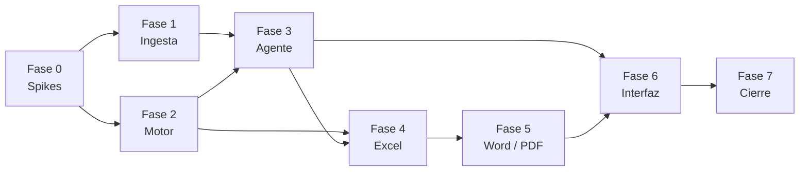

# Ajustador de Siniestros — Plan de desarrollo

> Complementa [`01-informe-analisis-y-diseno.md`](01-informe-analisis-y-diseno.md) y [`03-prompt-maestro.md`](03-prompt-maestro.md).
> Tamaños: **S** ≈ 1–2 días · **M** ≈ 3–5 días · **L** ≈ 1–2 semanas (una persona). Son estimaciones relativas, no compromisos.
> Reglas del proyecto: todo en español; commit + push al cerrar cada fase; **ningún deploy a producción sin orden explícita**; la batería de seguridad se instala en la fase 0 y se ejecuta al cerrar cada sesión.

---

## Decisiones ya tomadas

| Tema | Decisión | Motivo |
|---|---|---|
| Interfaz | Next.js (App Router) + Tailwind | Pedido |
| Base de datos | PostgreSQL en Supabase, migraciones con Supabase CLI | Pedido; RLS y Storage incluidos |
| IA | Gemini API (multimodal, salida JSON con esquema); modelo por variable de entorno | Pedido; el identificador se valida al implementar |
| Documentos | Worker Python (openpyxl, docxtpl/python-docx, LibreOffice sin cabeza, Playwright) | El Excel «vía Python» está en el requisito; el Word y el PDF necesitan contenedor |
| Lógica de dinero | Solo código (motor determinista), nunca el LLM | Reclamación inmutable, totales exactos |
| Word | Se parte de la plantilla real `.docx`, no se regenera | «Modelo exacto» |

## Decisiones pendientes (bloquean fases concretas)

| # | Pregunta | Bloquea |
|---|---|---|
| 1 | ¿`Ajuste vN.xlsx` es la versión emitida en los casos 1–3? | Fase 4 (golden) |
| 2 | Letra OBS para cantidad 0 y tabla de partidas globales | Fase 4 |
| 3 | ¿Una sola liquidadora o varias? | Fase 5 |
| 4 | Texto de la denuncia: ¿manual o archivo? | Fase 5 |
| 5 | Despliegue del worker (¿Coolify?) | Fase 0 |
| 6 | Dueño y frecuencia del baremo | Fase 2 |
| 7 | Crear un proyecto Supabase nuevo y exclusivo de `cesar` | Fase 0 |
| 8 | Plan/modelo de Gemini y condiciones de datos | Fase 3 |

---

## Estructura del repositorio

```text
cesar/
├─ fuente/                      # casos de referencia (no se versionan fotos; ver .gitignore)
├─ docs/                        # esta documentación
├─ apps/web/                    # Next.js + Tailwind
│  ├─ app/(auth)/ app/casos/ app/baremo/ app/evaluacion/
│  ├─ components/               # tabla Reclamación|Ajuste, bandeja Falta dato, visor de fotos
│  └─ lib/                      # cliente Supabase, cliente del worker, validadores zod
├─ services/worker/             # Python (FastAPI)
│  ├─ extraccion/               # pdf, docx, xlsx, ocr
│  ├─ motor/                    # cubicacion, baremo, totales, uf, hash
│  ├─ documentos/               # excel, word, pdf, anexo, cuadro_png
│  ├─ meteorologia/             # estaciones, captura Playwright
│  └─ plantillas/               # informe.docx, anexo.doc→docx, ajuste.xlsx (derivadas de fuente/)
├─ prompts/                     # system prompt y esquemas versionados
├─ supabase/migrations/         # SQL versionado
├─ tests/golden/                # casos 1–4 con resultados esperados
└─ scripts/bateria-seguridad.ps1
```

---

## Fase 0 — Cimientos y *spikes* de riesgo  (L)

**Objetivo:** eliminar las cuatro incógnitas técnicas antes de construir nada.

| Tarea | Tamaño | Criterio de aceptación |
|---|---|---|
| Scaffold Next.js + Tailwind + TypeScript estricto (sin `any`) | S | `build` y `start` en ese orden sin errores |
| Instalar batería de seguridad desde `~/.agents/templates/security-battery/` y workflow Strix | S | `pwsh ./scripts/bateria-seguridad.ps1` en verde |
| Bitácora de peticiones (`bitacora/`) | S | Se crea sola en el primer uso |
| Proyecto Supabase nuevo (con su aprobación) + `supabase init` + primera migración | S | `supabase db push` aplica; sin tocar otras bases |
| **Spike A — INIA:** localizar el endpoint de la serie histórica; capturar con Playwright el gráfico con tooltip del 16/07/2026 de Aeródromo Maquehue | M | Imagen equivalente a la que adjuntó + valores 4,3 mm / 19,9 km/h / 58,7 km/h leídos de los datos, no del pixel |
| **Spike B — Gemini:** extraer el acta del caso 3 y el presupuesto PDF del caso 4 a JSON con esquema | M | Aritmética `cant × PU = total` cuadra en todas las líneas; mandato escaneado leído por visión |
| **Spike C — Word:** rellenar la plantilla del caso 4 (campos, 2 tablas de fotos, imagen de INIA, cuadro) y convertir a PDF | M | Comparación visual contra el informe final del caso 1: mismas cabeceras, pies, logo, secciones |
| **Spike D — Excel:** abrir `Ajuste v1.xlsx`, cargar líneas por código y guardar conservando formato y fórmulas | S | El libro abre en Excel sin reparación; totales recalculan |
| Definir hosting del worker (pregunta 5) y `Dockerfile` | S | Contenedor corre los cuatro spikes |

**Salida de la fase:** informe corto de los spikes con evidencia (capturas, salidas). Si el Spike A falla, se activa el plan B (serie por API + gráfico propio, o captura subida a mano).

---

## Fase 1 — Ingesta y extracción  (L)

- Carga múltiple (carpeta o archivos) a Supabase Storage privado; hash y tipo detectado por nombre + contenido (acta, provisión, presupuesto, mandato, informe técnico, foto, carta).
- Extracción: PDF/DOCX/XLSX nativos; **OCR con visión solo si el PDF no tiene texto** (mandatos escaneados).
- Presupuesto en PDF → tabla estructurada con **doble validación aritmética** (línea y total contra el declarado por el contratista).
- Fotos: clasificación por recinto (carpeta como pista), descripción, **detección y exclusión de cédulas**.
- Modelo `facts` con procedencia (extraído / deducido / faltante).

**Aceptación:** los 4 casos cargan sin intervención; las líneas del presupuesto de los casos 1, 3 y 4 reproducen exactamente los totales de reclamación ($5.716.010, $8.060.090, $5.147.340 netos directos); ninguna cédula llega a la API ni al informe.

---

## Fase 2 — Motor determinista y baremo  (L)

- Importar `Datos` (417 filas) a `baremo_items`; resolver duplicados con candidatos; inferir unidad y categoría.
- `cubicacion`: muro neto, paño `(perímetro·alto·0,7)/4`, cielo, piso, ml — **portado desde la hoja `Calculo de Area`** y probado contra sus valores (5,38 / 10,24 / 9,22 del caso 1).
- Constantes nombradas únicas: plancha 2,88 · preventiva 1 · GG/utilidades · IVA · porcentaje de vanos 30 %.
- UF por fecha de pérdida desde `mindicador.cl` con caché en `uf_values` (el 15 y 16/07/2026 deben dar 40.844,79).
- Cálculo de totales (directo → GG/utilidad → neto → IVA → UF → indemnización) idéntico a la hoja `EDIFICIO`; soporta 25 % unificado y 12 % + 10 %.
- Hash de la reclamación, tabla `claim_lines` sin `UPDATE`.

**Aceptación:** con las cantidades/precios del `Ajuste v1` de cada caso el motor reproduce **exactamente** UF 46,73 / 26,49 / 27,41. Tests unitarios con esos valores.

---

## Fase 3 — Agente de ajuste  (L)

- System prompt y esquema de [`03-prompt-maestro.md`](03-prompt-maestro.md) versionados; cliente Gemini con salida estructurada, reintento con el error del validador y registro en `llm_runs`.
- Validadores del §3 del prompt maestro (PU > 0, letras válidas, precios verificables, sin frases prohibidas, procedencia de fotos).
- Modo *pérdida determinada* (caso 2: sin presupuesto; una sola columna).
- Marcador `**[FALTA DATO: Rellenar con XXX]**` generado de forma uniforme desde `faltantes`.
- Suite de evaluación (`tests/golden`): casos 1–3 para iterar; **caso 4 congelado**.

**Aceptación (a acordar con usted):** reporte por línea de coincidencia de letra OBS, desviación de cantidad y de PU, y total UF dentro de una banda definida de antemano; cero violaciones de validadores en los 4 casos; el caso 4 se ejecuta una sola vez al final.

---

## Fase 4 — Generación del Excel  (M)

- Partir de `ajuste.xlsx` (hojas `EDIFICIO`, `Datos`, `Calculo de Area`, `Siniestros anteriores`, `%`).
- Cabecera, líneas, **sub-líneas de partidas agrupadas** (línea madre en blanco en Ajuste), totales con **fórmulas vivas**, Indicador FDP = UF de la fecha, leyenda A–F exacta, fila Deducible.
- Imagen del **cuadro de pérdida** (PNG de la hoja `EDIFICIO`) para el Word.

**Aceptación:** abre en Excel sin reparaciones; el recálculo coincide con el motor; la leyenda es literalmente la de su prompt; comparación celda a celda contra el golden sin diferencias no justificadas.

---

## Fase 5 — Informe Word, PDF y anexo  (L)

- Plantilla `informe.docx` con marcadores: portada, cuantía, denuncia, características, evidencia, **bloques de fotos de 2 columnas por recinto**, meteorología (texto + imagen + pie «Fuente»), cobertura, ajuste, resumen del ajuste, cuadro de pérdida, conclusión, firma, anexo legal.
- Limpieza de errores heredados de la plantilla («CAD120130071para», «de la nturaleza»).
- Anexo de fotografías: portada + 2×2 por recinto.
- PDF por conversión del mismo `.docx`.
- Meteorología: estación más cercana por distancia, valores y captura (resultado del Spike A).
- Paquete ZIP: `.xlsx` + `.docx` + `.pdf` + anexo.

**Aceptación:** el informe generado del caso 1 se compara página a página con `INFORME FINAL.docx` (mismas secciones, cabeceras, pies, logo y presencia de imágenes); el del caso 4 se revisa con usted.

---

## Fase 6 — Interfaz de revisión  (L)

- Lista de casos y estados; carga guiada con checklist de antecedentes.
- Vista de caso en 3 columnas: documentos/fotos · hechos con procedencia + bandeja **Falta dato** · tabla Reclamación | Ajuste con letra OBS y justificación.
- Edición de cualquier línea (regenera totales y documentos); marca visual de datos deducidos; bloqueo de exportación «limpia» con marcadores abiertos.
- Pantalla de baremo (búsqueda, alta de precio de mercado con fuente).
- Cumplir contraste claro/oscuro medido por WCAG con paneles abiertos, recargando tras cambiar de tema.

**Aceptación:** flujo completo de un caso real de principio a fin en el navegador, con capturas en claro y oscuro y escritorio/móvil.

---

## Fase 7 — Evaluación, seguridad y cierre  (M)

- Informe de evaluación sobre los 4 casos (métricas y diferencias).
- Strix / OWASP sobre autenticación, subida de archivos y API; RLS probado con dos organizaciones.
- Revisión de datos personales y condiciones de la API de Gemini.
- Documentación (`DEVmemory.md`) y manual de uso con capturas sin datos personales (barras sólidas al capturar).
- `+dap` al cierre: commit, push, árbol limpio. **Deploy solo con su orden.**

---

## Orden y dependencias



Las fases 1 y 2 pueden avanzar en paralelo. La fase 6 puede empezar con datos simulados en cuanto exista el esquema de la fase 3.

## Definición de «terminado» por fase

Nada se da por resuelto sin evidencia: salida de un comando, test en verde o captura. Lo no probado se declara como tal en el informe de cierre de la fase.

## Primer paso propuesto

Fase 0, empezando por los **Spikes A y C** (INIA y fidelidad del Word): son los dos que, si fallan, cambian el diseño. Necesito solo las respuestas 5 y 7 de arriba para arrancar.
